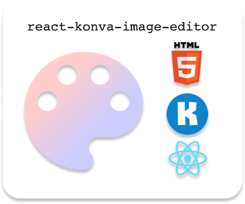
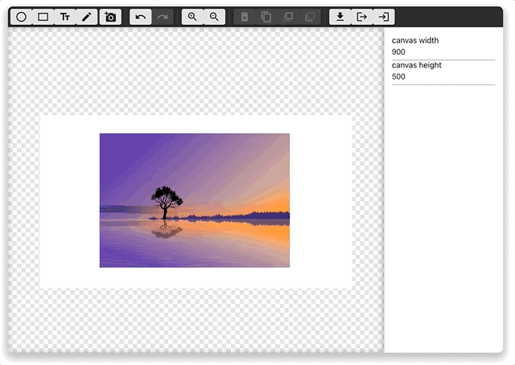
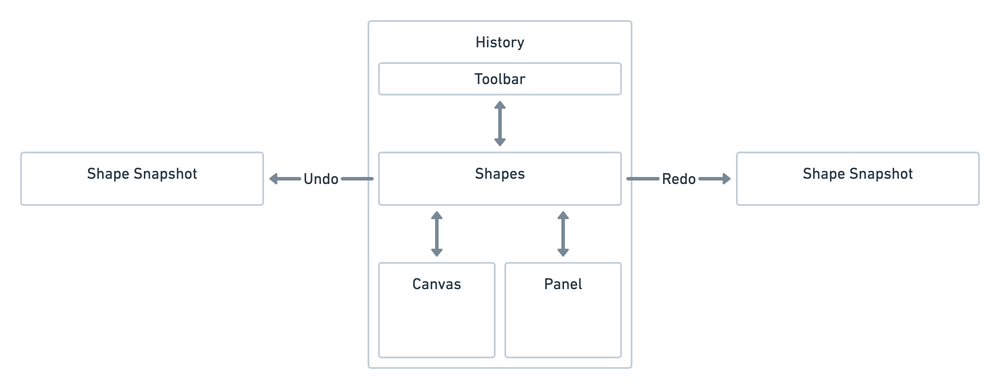
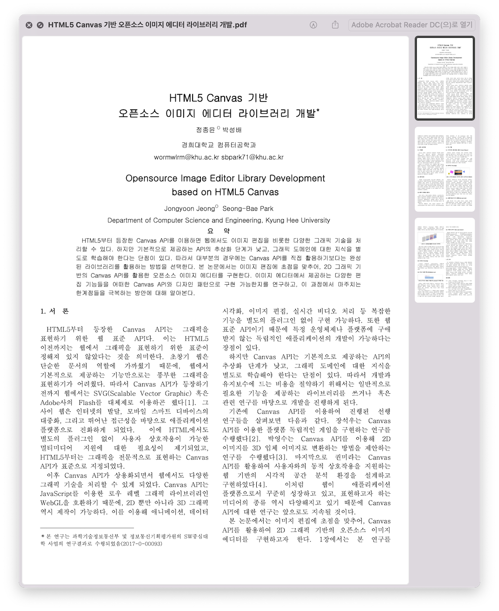

# react-konva-image-editor

<p align="center">
  
</p>

## Subject

> - (국문) HTML5 Canvas 기반 오픈소스 이미지 에디터 라이브러리 개발
> - (영문) Opensource Image Editor Library Development based on HTML5 Canvas

- 본 프로젝트는 2021-2학기 경희대학교 캡스톤 디자인 1 - 산업체 주제(모바일 앱개발 협동조합)를 바탕으로 개발했습니다.

## Members

- 정종윤(@wormwlrm)

## Abstract

HTML5부터 등장한 Canvas API를 이용하면 웹에서도 이미지 편집을 비롯한 다양한 그래픽 기술을 처리할 수 있다. 하지만 기본적으로 제공하는 API의 추상화 단계가 낮고, 그래픽 도메인에 대한 지식을 별 도로 학습해야 한다는 단점이 있다. 따라서 대부분의 경우에는 Canvas API를 직접 활용하기보다는 완성 된 라이브러리를 활용하는 방법을 선택한다.

본 프로젝트에서는 이미지 편집에 초점을 맞추어, 2D 그래픽 기반의 Canvas API를 활용한 오픈소스 이미지 에디터를 구현한다. 이미지 에디터에서 제공하는 다양한 편집 기능들을 어떠한 Canvas API와 디자인 패턴으로 구현 가능한지를 연구하고, 이 과정에서 마주치는 한계점들을 극복하는 방안에 대해 알아본다.

## Overview

<p align="center">
  
</p>

> 별도 제작한 [데모 페이지](https://wormwlrm.github.io/react-konva-image-editor-demo)에서 동작하는 예시를 확인할 수 있습니다.

본 프로젝트에서는 다음과 같은 기능을 지원합니다. 기능에 대한 자세한 설명은 아래에서 확인할 수 있습니다.

- [x] 라이브러리 형태로 패키지 릴리스
- [x] 호스트 옵션 제공
- [x] 이미지/도형 컴포넌트 생성 및 편집
- [x] 수정 가능한 텍스트 컴포넌트 제공
- [x] 컴포넌트 복제/삭제
- [x] 실행 취소/다시 실행
- [x] 드로잉
- [x] 이미지 저장
- [x] 캔버스 확대 및 축소
- [x] Z-index 조정
- [x] 이미지 저장
- [x] 직렬화를 이용한 수정 내역 저장 및 복원 기능

### Motivation

이 프로젝트는 산학 협력 프로젝트의 주제의 응용으로부터 시작하였습니다. 기존 주제는 이미 배포된 이미지 편집 라이브러리를 사용하는 웹 애플리케이션을 제작하는 구현 프로젝트였습니다. 하지만 이미 구현된 라이브러리를 단순히 이용하는 것은 큰 의미가 없다고 생각했고, 보다 도전적으로 접근해서 다른 사람이 사용할 수 있는 라이브러리 자체를 제작해보고 싶다는 생각이 들었습니다. 이 과정에서 산업체의 허락을 구했고, 웹 환경에서 이미지 편집 기능이 포함된 라이브러리를 직접 제작하기로 했습니다.

### Considerations

- **추상화**: Canvas API에서 제공하는 기본 추상화 단계가 낮아, 실제 애플리케이션 레벨에서 기능을 쓰기에는 생산성이 낮습니다. 따라서 2D 그래픽에 대한 기본 추상화를 제공하는 라이브러리 Konva.js를 활용하였습니다.
- **상태 관리**: Canvas 위에 그려진 이미지, 도형 및 수정 사항들을 객체지향적으로 관리하면서 데이터와 뷰를 일치시키고자 React.js를 활용하였습니다.
- **라이브러리**: JavaScript 모듈 시스템에 적합한 형태여야 하고, 브라우저 및 패키지 관리자를 통해 다운로드 가능해야 하므로 Rollup.js 및 NPM을 사용함으로써 활용하였습니다.

### Architecture

본 프로젝트의 아키텍처는 다음과 같습니다.



- **Shapes Layer**: 캔버스에 그려지는 모든 도형, 사용자 상태 등을 관리합니다. 또한 캔버스와 패널, 툴바 사이의 상호작용을 중재합니다.
  - **Snapshot**: 특정한 사용자 액션(도형 생성, 이동, 스타일 수정 등)이 발생하여 히스토리를 저장해야 할 경우, 현재 도형을 스냅샷으로 저장하고 히스토리에 추가합니다.
- **History Layer**: 저장된 스냅샷 배열을 기반으로 실행 취소 및 다시 실행 기능을 지원합니다.
- **Canvas Layer**: Shapes Layer에 저장된 도형들을 실제 2D 그래픽으로 표현하고, 사용자로부터 입력받은 상호작용을 Shapes Layer에 넘겨줍니다.
- **Toolbar Layer**: 사용자 상호작용을 명시적으로 입력받는 영역입니다.
- **Panel Layer**: 현재 선택된 도형의 속성을 표시하는 영역입니다.

### Features

본 프로젝트에서는 다음과 같은 기능을 지원합니다.

#### 라이브러리 형태로 패키지 릴리스

데모 프로젝트 확인을 위해 현재까지의 개발 사항을 node.js 패키지 매니저인 [NPM](https://www.npmjs.com/package/react-konva-image-editor)에 배포한 상태입니다. 따라서 터미널에서 다음과 같은 명령어를 입력하면 설치가 가능합니다.

```bash
# for this package
$ npm install react-konva-image-editor

# for peer dependencies
$ npm install react react-dom
```

호스트 측에서 다음과 같이 호출하여 사용할 수 있습니다.

```js
// App.js
import { Editor } from 'react-konva-image-editor';

return (
  <Editor />
);
```

#### 호스트 옵션 제공

라이브러리를 설치하여 사용하는 호스트에서 에디터 레이아웃에 대한 옵션값을 설정할 수 있습니다.

```js
const props = {
  width = window.innerHeight, // Number, 명시적으로 너비 설정
  height = 500, // Number, 명시적으로 높이 설정
  responsive = false, // Boolean, 반응형 설정
  aspectRatio = 1, // Number, 반응형 설정 시 너비와 높이 비율 설정
}

return (
  <Editor {...props} />
);
```  

#### 이미지/도형 컴포넌트 생성 및 편집

<https://user-images.githubusercontent.com/26682772/145718038-42747719-298d-45d5-b2c9-b1be1c23239e.mov>

캔버스에 이미지와 도형 인스턴스를 생성할 수 있습니다. 각 도형은 드래그 가능하며(Draggable), 자체적으로 회전, 리사이징이 가능(Transformable)합니다.

이미지 및 도형 인스턴스는 Shape Layer에서 관리되며, 각 컴포넌트에 대한 속성 정의는 `components` 폴더에 정의되어 있습니다.

이미지를 불러올 때에는 이미지 파일을 Base64로 인코딩하여 사용합니다.

#### 실행 취소/다시 실행

<https://user-images.githubusercontent.com/26682772/145718069-e9ac7410-0165-4cb1-9f92-7eb81fc3daf0.mov>

실행 취소와 다시 실행 기능을 위해 메멘토 패턴을 적용했습니다. 메멘토 패턴은 히스토리를 저장하는 Caretaker 역할, 그리고 히스토리를 가리키는 인덱스를 띄워주는 Originator 역할으로 구성됩니다.

여기서 Caretaker 역할을 하는 것이 History Layer입니다. 도형에 대한 사용자 상호작용(드래그, 회전, 리사이징 등)이 발생할 때마다 History Layer는 현재 Shapes Layer의 인스턴스를 스냅샷을 생성하고 배열로 관리합니다.

History Layer에는 특정 스냅샷을 가리키는 인덱스가 정의되어 있습니다. 따라서 실행 취소 이벤트가 발생할 때에는 인덱스를 1만큼 감소시키며, 다시 실행 이벤트가 발생할 때에는 인덱스를 1만큼 증가시킵니다.

Shapes Layer는 현재 History Layer에서 가리키는 스냅샷을 가져옵니다. Canvas Layer는 Shapes Layer의 인스턴스 배열에 종속적이기 때문에, 저장된 인스턴스를 캔버스에 표시합니다.

#### 드로잉

<https://user-images.githubusercontent.com/26682772/145718089-751a0abc-ee86-4511-80ab-1543f2a21473.mov>

드로잉은 기본적으로 드래그 앤 드롭과 동일한 입력을 받지만 다르게 동작해야 합니다. 따라서 툴바에서 드로잉 모드를 선택하게 되면, 캔버스에 있는 도형들은 더 이상 드래그 가능하지 않게 됩니다. 이는 도형 위에서 드로잉을 시작했을 때, 도형이 드래그 되는 현상을 막기 위해서입니다.

마우스 커서를 누르면 `onmousedown` 이벤트가 발생하게 되는데, 이때 x, y 좌표를 구할 수 있습니다. 따라서 이 좌표를 이산적으로 덧붙이면서 라인 컴포넌트의 경로를 표시할 수 있습니다.

라인 컴포넌트 역시 도형 인스턴스로 취급됩니다. 따라서 드래그와 변환이 가능합니다.

하지만 마우스를 떼기 전까지 라인 컴포넌트는 아직 생성된 상태가 아니지만, 현재까지의 경로를 캔버스에 표시해주어야 할 필요가 있습니다. 따라서 마우스를 떼기 전까지 좌표 배열을 임시로 저장하고, 마우스를 뗄 때 저장된 좌표 배열을 이용해 Shape Layer에 새 라인 컴포넌트를 생성합니다.

#### 수정 가능한 텍스트 컴포넌트 제공

<https://user-images.githubusercontent.com/26682772/145718104-01e7da02-e35f-49e8-8281-f1b8880ae069.mov>

HTML5 스펙에 따르면, 캔버스에서 텍스트를 렌더할 수는 있지만 캔버스 내에서 입력값을 직접 수정할 수 있는 인풋(input) 형태로는 제공되지 않습니다. 따라서 해당 기능이 필요한 경우가 있다면 Canvas API를 적절히 우회하여야 합니다.

수정 가능한 텍스트 컴포넌트를 만들기 위해서는 Canvas API와 외부 DOM 엘리먼트 간 스타일 및 데이터를 동기화했습니다.
우선 캔버스에 텍스트를 나타낼 수 있는 텍스트 컴포넌트를 정의합니다. 이 역시 도형 인스턴스로 취급되므로 드래그와 변환이 가능해야 합니다.

만약 텍스트 컴포넌트에 더블 클릭이나 <kbd>enter</kbd>키 등의 이벤트가 발생하면 해당 위치에 `<textarea>` 엘리먼트를 생성합니다. 이 때 캔버스의 줌, 텍스트 컴포넌트의 회전, 줄바꿈을 고려하여 어색함이 없도록 스타일을 적절히 조정해줍니다.

<kbd>enter</kbd>키 입력 시 값을 저장하고, <kbd>shift</kbd> + <kbd>enter</kbd>키를 누를 땐 줄바꿈이 일어나야 합니다. 포커스를 잃었을 때에는 자동으로 `<textarea>` 가 삭제되도록 합니다.

#### 캔버스 확대 및 축소

<https://user-images.githubusercontent.com/26682772/145718305-dbe41202-d872-4d92-a5ea-47dfa597e871.mov>

줌 배율을 지정하는 변수를 선언하고, 이를 캔버스 레이어에 적용하고 적절히 리사이징합니다.

이 때 기존의 도형 인스턴스 배치에 영향이 가지 않게 합니다.

한편 캔버스 영역이 보여지는 화면보다 클 경우 스크롤 가능하게 만듭니다.

#### Z-index 조정

<https://user-images.githubusercontent.com/26682772/145718128-7024a879-ed43-436a-a834-608cfa0cccbd.mov>

도형 간 z-index 조정은 Shape Layer의 도형 인스턴스 배열의 순서를 바꾸는 방식으로 구현 가능합니다.

#### 이미지 저장 및 직렬화 기반 저장 및 복원 기능

<https://user-images.githubusercontent.com/26682772/145718140-2ecfcfc6-2a85-4e88-a688-b5feb4a2a89a.mov>

이미지 저장 기능은 현재 렌더된 화면을 이미지 파일로 저장할 수 있는 Canvas API의 `toDataURL()` 메서드를 사용하여 제공합니다.

도형을 인스턴스화했기 때문에, 현재까지의 편집 내역이 담긴 Shape Layer의 도형 인스턴스 배열을 직렬화하여 JSON 파일로 저장할 수 있습니다.

이후 JSON 파일을 불러올 때, Shape Layer 배열에 적절히 매칭시키는 기능까지 구현된 상태입니다.

##### 활용 예시


본 프로젝트는 현재까지의 캔버스에 그려진 도형 상태를 JSON 포맷으로 직렬화할 수 있고, 이를 파일로 다시 불러올 수 있다는 점에서 독창성이 있다. 이를 설명하기 위해, 관련 오픈소스인 [NHN Toast UI Image Editor](https://github.com/nhn/tui.image-editor)와 비교해 해당 기능을 설명한다.

NHN의 Toast UI Image Editor는 결과물로 이미지 파일만 추출(export) 할 수 있다. 따라서 현재 캔버스가 그려져 있는 웹 브라우저를 닫게 되면 메모리에 올라가 있는 데이터들이 모두 사라지기 때문에, 해당 결과물을 다시 복구하거나 수정할 수 없다.

한편 본 프로젝트에서는 데이터 직렬화 기능을 지원하기 때문에, 사용자의 현재 작업 내역을 JSON 파일로 저장할 수 있다. 따라서 해당 JSON 파일을 역직렬화하면서 작업 내역을 복구할 수 있다. 만약 JSON 파일을 다른 사용자에게 공유할 수 있다면, 동일한 작업 내역을 여러 사용자에게 제공할 수도 있다. 이 기능을 호스트 쪽 데이터베이스 등에 저장해둘 수 있다면 이 장점이 극대화된다. 사용자는 원격 서버에 본인의 작업 내역을 저장해두고 언제든 불러올 수 있기 때문이다.

## Conclusion & Limitations

- HTML5의 Canvas API를 활용하여 이미지 에디터 라이브러리를 제작하고, 각 기능들의 구현 방법과 한계점에 대해 연구하고 소스 코드를 공개했습니다.
- 애플리케이션 레벨에서 적합한 고수준의 추상화를 제공하는 라이브러리를 활용하고, 상황에 맞는 디자인 패턴을 사용함으로서 이미지 에디터의 기능을 구현할 수 있었습니다.
- Canvas API의 범위를 넘어서는 요구사항에 대해서는 기술적으로 우회하면서도 사용자 경험을 해치지 않았다는 점에서 의의가 있었습니다.
- 다만 시간적 여유 상 기능성 다양화 및 사용자 편의를 위한 부가적인 기능들(키보드 단축키 지원 등)에 대해서는 구현이 완료되지 않은 부분이 있습니다.
- 또한 복잡한 상태 관리 및 UI 라이브러리 적용으로 인해 코드 가독성 및 성능 최적화 면에서 다소 부족한 부분이 있습니다.
- 향후 기능 추가 및 유지보수를 통해 성능과 편의를 개선해 나갈 예정입니다.

## References

프로젝트 개발 중 참고한 자료입니다.

### Papers

- [장석우, 허문행, HTML5 캔버스를 이용한 플랫폼 독립적인 게임의 구현, 한국정보통신학회논문지, 제18권, 제12호, pp. 3042-3048, 2014](https://www.kci.go.kr/kciportal/ci/sereArticleSearch/ciSereArtiView.kci?sereArticleSearchBean.artiId=ART001946202)
- [박영수, HTML5에서 직선의 기울기를 이용한 2D to 3D 입체 이미지 변환, 디지털융복합연구, 제12권, 제12호, pp. 521-528, 2014](https://www.kci.go.kr/kciportal/ci/sereArticleSearch/ciSereArtiView.kci?sereArticleSearchBean.artiId=ART001939840)
- [박미라, 박기호, 안재성, HTML5 Canvas를 활용한 시각적 공간분석 환경의 설계와 구현, 한국지리정보학회지, 제14권, 제4호, pp.44-53, 2011](https://www.kci.go.kr/kciportal/ci/sereArticleSearch/ciSereArtiView.kci?sereArticleSearchBean.artiId=ART001615401)

### Others

- [Vitaly Friedman, Smashing Book 6: New. Frontiers In Web Design, 2018](https://www.smashingmagazine.com/2018/09/smashing-book-6-release/)
- [Konva.js](https://konvajs.org/)
- [React.js](https://reactjs.org/)
- [Rollup.js](https://rollupjs.org/)
- [TypeScript](https://www.typescriptlang.org/)
- [Typescript + React + Rollup으로 풀세트 Component Library 만들기](https://velog.io/@_junukim/Typescript-React-Rollup%EC%9C%BC%EB%A1%9C-%ED%92%80%EC%84%B8%ED%8A%B8-Component-Library%EB%A7%8C%EB%93%A4%EA%B8%B0)
- [Rollup을 사용하여 디자인 시스템 번들 후, npm 라이브러리로 배포하기](https://velog.io/@velopert/bundle-with-rollup-and-publish-to-npm)

## 보고서

<p align="center">
  
</p>

_해당 논문은 2021 한국정보과학회 학부생 논문경진대회 본선 진출작입니다._

- [x] [최종보고서](reports/CD1_6팀(최종보고서).docx)
- [x] [한국정보과학회 논문](reports/HTML5_Canvas_기반_오픈소스_이미지_에디터_라이브러리_개발.pdf)
- [x] [한국정보과학회 학부생경진대회 발표영상](reports/304_정종윤(경희대학교).mp4)
